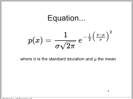
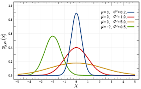

# Example scene generation with pathtracing & raytracing from scratch

> For the spanish version, see [spanish](README.md)

This is an example of using the raytracing and pathtracing algorithms to generate images, taking as a sample a real scene where a candle lights a porcelain bell.

## Run
```
dotnet run
```

## Modeling

### Bell

The body of the bell was generated from the function "Gaussian Bell" in revolution on the y axis. The bell handle was obtained by interpolating several points with a bezier curve also in revolution on the y-axis.

### Candle

The candle was divided in several meshes:
- fire
- burned stick
- wax
- glass (body & bottom)

All of these meshes were generated using simple geometry and bezier curves in revolution.

## Materials

### Bell

To achieve the "porcelain" effect in the mesh we use the gray color with a specular value higher than normal, which allows the light that enters the body to be reflected.

<div style="display: flex; flexDirection: row;">

<div style="margin: 0 10px;">

  

</div style="margin: 0 10px">

<div>

  

</div>

</div>

### Candle

The candle fire had an emissive material with a warm color that served as a light source, in addition a small value of emissive material was added in the wax which makes it appear that it reflects light, along with a slight yellow color, all this gives it the wax a gradient color effect.

### Floor

The floor has a dark texture together with reflective material that allows it to reflect part of the light it receives, together with diffuse material, this allows the glass with the blurred candle to be seen on it.


## Raytracing result


## Pathtracing result `(512 x 512)`

### `640 iterations`


### `830 iterations`


