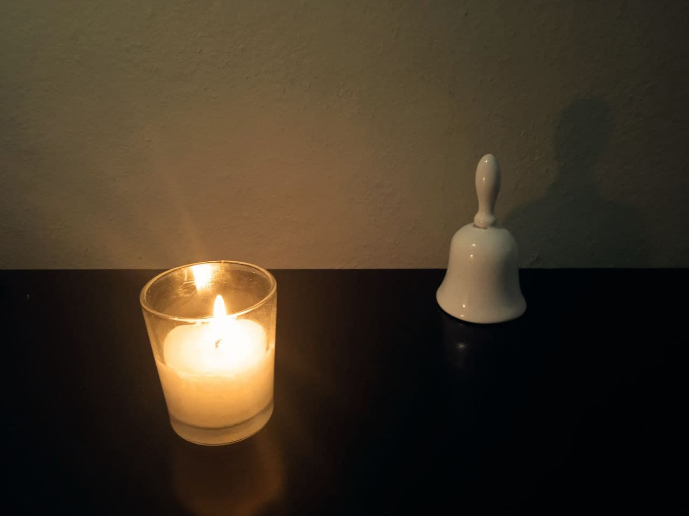
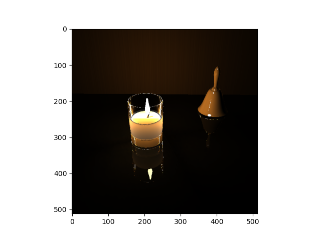
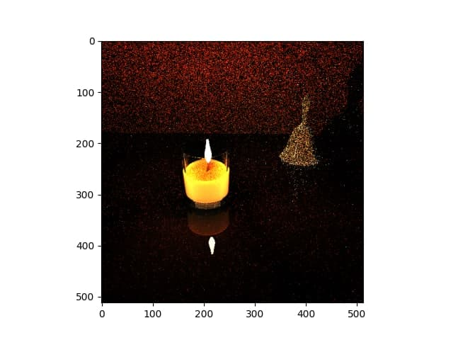

# Ejemplo de generación de imágenes usando `Pathtracing & Raytracing` desde 0



- Estudiantes
  * Samuel David Suárez Rodríguez
  * Enmanuel Verdesia Suárez

> Para la versión en inglés, ver [inglés](README.md)

Este es un ejemplo de uso de los algoritmos `raytracing` y `pathtracing` para generar imágenes, tomando como ejemplo una escena real donde una vela alumbra una campana de porcelana.

## Ejecutar
```
dotnet run
```

## Modelado

### Campana

El cuerpo de la campana fue generado a partir de la función "Campana de Gauss" haciendo una revolución sobre el eje t. El mango de la campana fue obtenido interpolando varios puntos con una curva de bezier también en revolución sobre el eje y.

<div style="display: flex; flexDirection: row;">

<div style="margin: 0 10px;">

  

</div style="margin: 0 10px">

<div>

  

</div>

</div>


### Vela

La vela fue dividida en varios `meshes`:
- fire
- burned stick
- wax
- glass (body & bottom)

Todos estos `meshes` fueron generados usando geometría simple y curvas de bezier en revolución.

## Materiales

### Campana

Para lograr el efecto "porcelana" en el `mesh` usamos color gris claro con un valor specular mayor de lo normal, lo que permite que parte de la luz sea reflejada luego de chocar con el cuerpo.

### Vela

El fuego de la vela posee un material `emissive` con un color cálido que sirve como fuente de luz, además, se añadió un pequeño valor de material `emissive` a la cera lo cual hace parecer que refleja luz, esto combinado con un ligero color amarillo provoca el efecto de gradiente en el cuerpo de la cera.

### Suelo

El suelo tiene una textura oscura con material `reflective` que permite reflejar parte de la luz que recibe, junto con material `diffuse`, lo que provoca que se refleje parte de la vela de manera difuminada al igual que la foto de muestra.

## Resultado de `Raytracing` (512 x 512)




## Resultado de `Pathtracing` `(512 x 512)`

### `640 iteraciones`


### `830 iteraciones`




### `1100 iteraciones`


